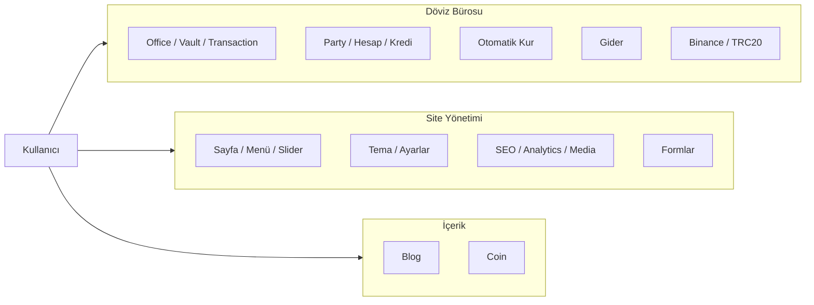
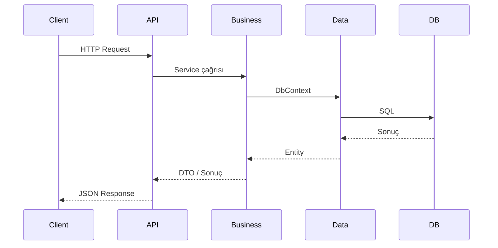

# SmileMedical — Sistem Mimarisi

## Katmanlı yapı

```mermaid
flowchart TB
  subgraph API["SmileMedical.API"]
    C[Controllers]
    H[Hosted Services]
  end

  subgraph Business["SmileMedical.Business"]
    U[User Services]
    E[ExchangeOffice Services]
    S[Site Services]
    B[Blog / Coin / Cache]
  end

  subgraph Data["SmileMedical.Data"]
    DBctx[SmileMedicalDbContext]
  end

  subgraph Entity["SmileMedical.Entity"]
    Ent[Entities]
  end

  subgraph DB[(SQL Server)]
  end

  API --> Business
  Business --> Data
  Data --> Entity
  Data --> DB
```

## Ana modüller



## Veri akışı



## Proje referansları

| Proje | Bağımlılıklar |
|-------|----------------|
| SmileMedical.API | Business, Data, Entity |
| SmileMedical.Business | Data, Entity |
| SmileMedical.Data | Entity |
| SmileMedical.Entity | — |

## Frontend

Admin arayüzü ayrı bir Vue 3 + Vite projesidir (`frontend/`). API’ye CORS ile bağlanır (localhost:5173, 5174, 5175 vb.).

```mermaid
flowchart LR
  User[Kullanıcı] --> Vue[Vue 3 + Vite]
  Vue -->|REST + JWT| API[SmileMedical.API]
  Vue -->|SignalR| Hub[/coinPriceHub]
```

- **Giriş:** `POST /api/v1/User/login`
- **Sayfalar:** Dashboard, User, Exchange, Vault, Party, Rates, Site, Blog, Coin
- Ayrıntı: [frontend/README.md](../frontend/README.md)

---

## Dokümantasyon indeksi

- **Görsel özet:** Tarayıcıda [docs/system-overview.html](system-overview.html) — tüm katmanlar ve bileşenler.
- **Frontend önizleme:** [docs/frontend-preview.html](frontend-preview.html) — ekran/API eşlemesi.
- **Döküman listesi:** [docs/README.md](README.md).
