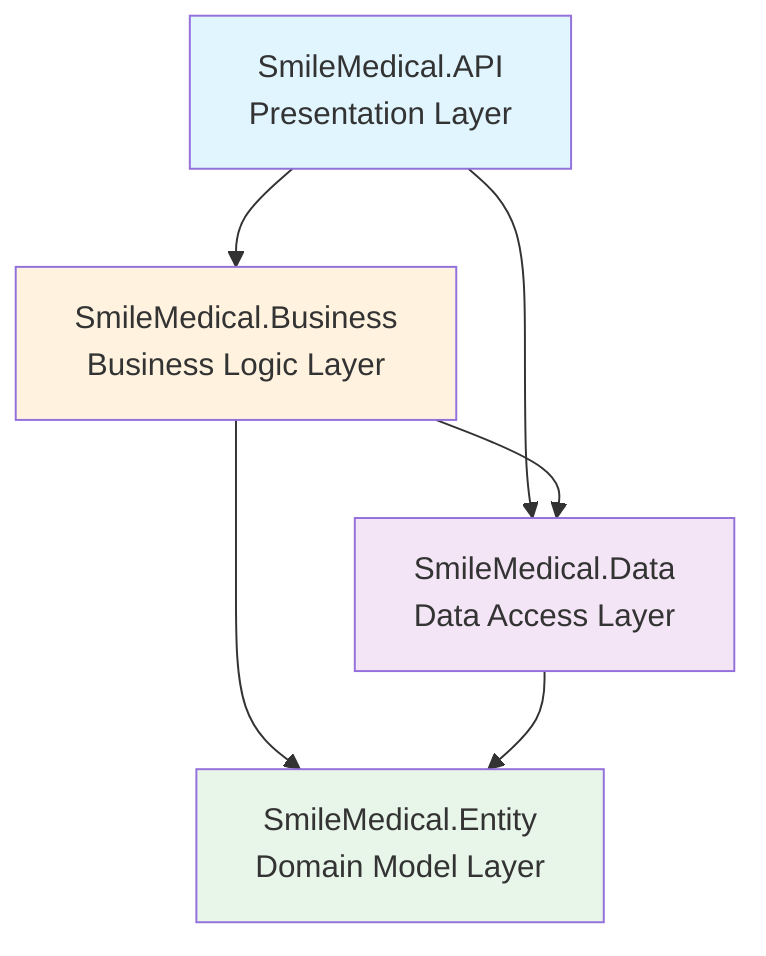

# SmileMedical.API - Derinlemesine Sistem Analizi

## 📋 Genel Bakış

SmileMedical.API, **döviz bürosu (exchange office) yönetimi** için geliştirilmiş profesyonel bir .NET 8 Web API uygulamasıdır. İsim "SmileMedical" olsa da, proje aslında **moneytransferturkey.com** ve **tradepanic.com** domainleri için döviz alım-satım, kripto para takibi ve CMS işlevlerini yönetmektedir.

### Proje Konumu
- **Kaynak Kod**: `c:\Users\CmkL-Owner\Desktop\QuantaQuokka_`
- **Build Çıktısı**: `c:\Users\CmkL-Owner\Desktop\app\SmileMedical.API`

---

## 🏗️ Mimari Yapı

Proje **4 katmanlı (layered) mimari** kullanmaktadır:



### Katman Sorumlulukları

#### 1. **SmileMedical.API** (Presentation Layer)
- REST API endpoint'leri
- JWT tabanlı authentication
- Dependency Injection konfigürasyonu
- Middleware yönetimi
- SignalR hub'ları

#### 2. **SmileMedical.Business** (Business Logic)
- İş mantığı servisleri
- Validasyon kuralları
- Domain servisleri
- SignalR hub'ları
- Exception handling

#### 3. **SmileMedical.Data** (Data Access)
- Entity Framework Core DbContext
- Database migrations
- Repository pattern (DbSet'ler üzerinden)

#### 4. **SmileMedical.Entity** (Domain Model)
- Entity sınıfları (62+ entity)
- DTO/Modal sınıfları
- Enum tanımları

---

## 🎯 Ana Fonksiyonel Domainler

Sistem 5 ana domain etrafında organize edilmiştir:

### 1. **Exchange Office** (Döviz Bürosu Yönetimi) 🏦

En kapsamlı ve kritik domain. Tam bir döviz bürosu ERP sistemi işlevselliğine sahiptir.

#### Alt Modüller:

**Currency Management (Para Birimi Yönetimi)**
- `Currency`: Para birimleri (USD, EUR, TRY, BTC, USDT vb.)
- `ExchangeRate`: Döviz kurları (alış/satış fiyatları)
- `ExchangeRateHistory`: Kur değişim geçmişi
- `ExchangeSettings`: Sistem ayarları (margin, spread vb.)
- `ExternalRateCache`: Dış kaynaklardan çekilen kurlar
- `ExternalDataSource`: Harici veri kaynakları (TCMB, Binance, Doviz.com)
- `PendingRateApproval`: Onay bekleyen kur değişiklikleri

> [!NOTE]
> Sistem otomatik kur güncelleme mekanizmasına sahip. TCMB, Binance ve Doviz.com (Harem, Ziraat, PTT, Kapalıçarşı) gibi 6 farklı kaynak kullanılıyor.

**Office & Vault Management (Ofis ve Kasa Yönetimi)**
- `Office`: Şube/ofis tanımları
- `Vault`: Kasa tanımları (her ofiste birden fazla kasa olabilir)
- `VaultBalance`: Anlık kasa bakiyeleri (para birimi bazında)
- `VaultBalanceHistory`: Bakiye değişim geçmişi
- `VaultCount`: Kasa sayımları
- `VaultBalanceSnapshot`: Periyodik kasa fotoğrafları
- `User_Office`: Kullanıcı-ofis ilişkilendirmesi

**Transaction Management (İşlem Yönetimi)**
- `Transaction`: Ana işlem kaydı
- `TransactionDetail`: İşlem detayları (hangi para biriminden ne kadar alış/satış)
- `CurrencySale`: Döviz satış kayıtları
- `DailySummary`: Günlük özet raporlar

**Party Account Management (Cari Hesap Yönetimi)**
- `Party`: Müşteri/tedarikçi tanımları
- `PartyAccount`: Para birimi bazında cari hesaplar
- `PartyAccountEntry`: Cari hesap hareketleri
- `PartyCreditLimit`: Kredi limitleri
- `PartyContact`: Müşteri iletişim bilgileri
- `PartyStatement`: Hesap ekstreleri
- `GhostPartyAccount`: Özel cari hesap türü
- `GhostPartyAccountEntry`: Ghost hesap hareketleri

> [!IMPORTANT]
> Party Account sistemi tam kapsamlı bir **muhasebe cari hesap** modülüdür. Borç/alacak takibi, vade takibi, kredi limit kontrolü gibi özelliklere sahiptir.

**Expense Management (Gider Yönetimi)**
- `ExpenseDefinition`: Gider tanımları
- `ExpensePayment`: Gider ödemeleri

**Blockchain Integration (Blokzincir Entegrasyonu)**
- Binance API entegrasyonu (TRC20/USDT işlemleri)
- `ITrc20Service` ve `BinanceService` servisleri

### 2. **Blog & Content Management** 📝

Tam özellikli bir blog/CMS sistemi:

- `Blog_Article`: Blog yazıları
- `Blog_Category`: Kategoriler
- `Blog_Article_Category`: Çoktan-çoğa ilişki
- `Blog_Article_Comment`: Yorumlar
- `Blog_Article_Visit`: Ziyaret istatistikleri
- `Blog_Article_Tag`: Etiketler
- `Tag`: Master etiket listesi

### 3. **Site Management** (CMS) 🌐

Dinamik site yönetimi:

**Navigation & Content**
- `Menu` & `Menu_Item`: Menü sistemi
- `Page` & `BuilderComponent`: Dinamik sayfa oluşturma (page builder)
- `Slider` & `Slider_Item`: Slider yönetimi
- `MediaFile`: Medya kütüphanesi

**Configuration**
- `Site_Settings`: Genel ayarlar
- `Language`: Çoklu dil desteği
- `Theme`: Tema yönetimi
- `GlobalColor`: Global renk şemaları
- `SeoSettings`: SEO ayarları
- `Analytics`: Analitik verileri
- `Form` & `Form_Submit`: Form builder ve gönderimler

### 4. **Cryptocurrency Tracking** 💰

Kripto para portföy yönetimi:

- `Coin`: Desteklenen coin'ler
- `Coin_Pair`: İşlem çiftleri (BTC/USDT vb.)
- `Coin_User`: Kullanıcı pozisyonları
- `Coin_User_Table`: Kullanıcı tabloları
- `Coin_Profit`: Kar/zarar hesaplamaları
- `Coin_User_Favorite`: Favori coin'ler

> [!TIP]
> SignalR üzerinden gerçek zamanlı coin fiyat güncellemeleri sağlanıyor (`CoinPriceHub`).

### 5. **User & Permission Management** 👥

- `User`: Kullanıcı hesapları
- `BlackList`: IP/kullanıcı engelleme
- `ActionLog`: Audit log sistemi
- JWT token invalidation (şifre değişikliğinde token geçersizleşmesi)

---

## 🔧 Teknoloji Stack

### Backend Framework
- **.NET 8.0** (en güncel LTS sürümü)
- **ASP.NET Core Web API**
- **Entity Framework Core 8.0.6**
- **SQL Server** (Database)

### Key Libraries & Tools

#### Authentication & Security
- `Microsoft.AspNetCore.Authentication.JwtBearer` (JWT authentication)
- `System.IdentityModel.Tokens.Jwt` (Token generation)
- Custom password change token invalidation

#### Data Access
- `Microsoft.EntityFrameworkCore.SqlServer`
- `Microsoft.EntityFrameworkCore.Design` (Migrations)
- Connection pooling (Min: 10, Max: 200)

#### Object Mapping
- `AutoMapper` (Entity-DTO mapping)

#### Real-time Communication
- `SignalR` (WebSocket tabanlı gerçek zamanlı iletişim)

#### API Documentation
- `Swashbuckle.AspNetCore` (Swagger/OpenAPI)

#### External Integrations
- `FirebaseAdmin` (Push notifications - şu anda yorum satırında)
- `MailKit` (Email gönderimi)
- `Google.Apis` (Google servisleri entegrasyonu)
- Custom HTTP clients (Binance, TCMB, Doviz.com API'leri)

#### Caching
- `MemoryCache` (In-memory caching)
- Custom cache clear mekanizması

### Database
- **SQL Server** (45.84.191.180:1433)
- Database: `mtturkey_exchange`
- Schema: `mtturkey_exchange`
- **Connection Pool**: Min 10, Max 200
- **Command Timeout**: 60 saniye
- **MultipleActiveResultSets**: Aktif

---

## 📊 Database Schema

### DbContext İstatistikleri

```
Toplam Satır: 849 satır kod
Toplam DbSet: 45+ entity
Toplam Konfigürasyon: 100+ Fluent API konfigürasyonu
```

### Önemli Database Özellikleri

#### 1. **Decimal Precision Kullanımı**

```csharp
// Para birimi işlemleri için yüksek hassasiyet
VaultBalance.Balance → decimal(18, 6)
TransactionDetail.Amount → decimal(18, 6)

// Kripto işlemleri için çok yüksek hassasiyet
Coin_User.Quantity → decimal(38, 18)

// Yüzde değerleri
ExchangeSettings.MarginPercent → decimal(5, 2)
```

#### 2. **DateTime Otomatik Conversion**

Tüm DateTime alanları için otomatik local time conversion mekanizması:

```csharp
- Database'den çekilen UTC tarihler otomatik Local'e çevriliyor
- SaveChanges sırasında CreatedDate, ModifiedDate otomatik set ediliyor
- TimeZone: Turkey (GetLocalTimeZone)
```

#### 3. **Cascade Delete Stratejileri**

Veri bütünlüğü için çeşitli delete behavior'lar kullanılıyor:
- `Cascade`: Parent silindiğinde child'lar da silinir
- `Restrict`: Child kayıt varsa parent silinemez
- `SetNull`: Parent silindiğinde FK null olur
- `NoAction`: Cascade path çakışmalarını önlemek için

#### 4. **Unique Constraints**

```csharp
Office.OfficeName → UNIQUE
Vault (OfficeId + Name) → UNIQUE COMPOSITE
ExchangeRate (OfficeId + SourceCurrencyId + TargetCurrencyId + EffectiveFrom) → INDEX
Party (OfficeId + PartyCode) → UNIQUE COMPOSITE
```

#### 5. **Indexing Strategy**

Performans için stratejik indexler:
- Transaction.TransactionDate
- Transaction.TransactionNumber (UNIQUE)
- PartyAccountEntry (PartyAccountId + EntryDate)
- PartyAccountEntry.PaymentStatus
- PartyAccountEntry.DueDate
- VaultBalanceSnapshot (OfficeId + SnapshotDate)

---

## 🔐 Güvenlik ve Authentication

### JWT Authentication

```csharp
Issuer: "tradepanic"
Audience: "tradepanic"
SecretKey: Base64 encoded (bG9uZ3NlY3JldGtleWludGhlc29mdHdvbGRidXRub3Rsb25nZW5vdWdo)
```

### Token Invalidation Mekanizması

> [!CAUTION]
> Kullanıcı şifresini değiştirdiğinde, eski token'lar otomatik olarak geçersiz hale geliyor. Token içindeki `iat` (issued at) claim'i ile `User.LastPasswordChangeDate` karşılaştırılıyor.

### CORS Politikası

Çok sayıda frontend domain'e izin veriliyor:
- localhost:3000-3012 (development)
- localhost:5173-5179 (Vite dev server)
- tradepanic.com
- moneytransferturkey.com  
- baskentenerji.com

---

## 🎨 API Controllers

### Controller Listesi (17 adet)

#### Blog Domain
- `BlogController`

#### Coin Domain
- `CoinController`

#### Exchange Office Domain
- `ExchangeController` (Ana işlem controller'ı)
- `ExchangeAutoRateController` (Otomatik kur yönetimi)
- `VaultSnapshotController` (Kasa sayım yönetimi)

#### Site Domain
- `AnalyticsController`
- `FormController`
- `GlobalColorController`
- `MediaController`
- `MenuController`
- `PageController`
- `SeoController`
- `SiteController` (Genel site ayarları)
- `SliderController`
- `TagController`
- `ThemeController`

#### User Domain
- `UserController`

---

## 🔄 Background Services

Sistem 3 background service ile çalışıyor:

### 1. **HostService**
Genel sistem başlatma ve maintenance işlemleri

### 2. **VaultCountingBackgroundService**
Periyodik kasa sayım kontrolleri ve otomatik snapshot oluşturma

### 3. **AutoRateUpdateBackgroundService**
Otomatik döviz kuru güncelleme:
- TCMB (Türkiye Cumhuriyet Merkez Bankası)
- Binance (Kripto)
- Doviz.com (4 farklı kaynak: Harem, Ziraat, PTT, Kapalıçarşı)

İlgili servisler:
- `AutoRateUpdateService`
- `RateCalculationService`
- `AnomalyDetectionService` (Kur anomalilerini tespit)

---

## 📂 Servis Mimarisi

Sistemde **Command-Query Separation** pattern'i uygulanmış:

```
IUserServiceCommand → Write operations (Create, Update, Delete)
IUserServiceQuery → Read operations (Get, List, Search)
```

### Registered Services (Program.cs'den)

**Core Services**:
- ValidationService
- EmailSender (MailKit)
- HttpContextAccessor

**Blog Services**:
- Blog_CategoryServiceCommand/Query
- Blog_ArticleServiceCommand/Query

**Site Services**:
- SettingsServiceCommand/Query
- LanguageServiceCommand/Query
- MenuServiceCommand/Query
- SliderServiceCommand/Query
- PageService
- AnalyticsService
- SeoService
- MediaService
- ThemeServiceCommand/Query

**Exchange Services**:
- ExchangeServiceCommand/Query
- VaultService
- VaultSnapshotService
- ExchangeRateService
- ExchangeTransactionService
- UserOfficeService
- ExchangeValidationService
- ExchangeReportingService
- ZReportService (Günlük Z raporu)
- OfficeServiceCommand

**Party Services**:
- PartyService
- GhostPartyService
- PartyAccountService
- PartyCreditService
- PartyReportingService
- PartyTransactionIntegration

**Expense Services**:
- ExpenseDefinitionService
- ExpensePaymentService

**Coin Services**:
- CoinPriceService (Singleton - gerçek zamanlı fiyat takibi)
- CoinServiceCommand/Query

**Cache Services**:
- CacheClearService

---

## 🧩 Önemli Infrastructure Patterns

### 1. **Exception Handling Middleware**

Custom exception handling middleware kullanılıyor:
```csharp
app.UseMiddleware<ExceptionHandlingMiddleware>();
```

### 2. **AutoMapper Profile**

Entity-DTO mapping için AutoMapper kullanılıyor.

### 3. **SignalR Hub**

Real-time coin fiyat güncellemeleri:
```csharp
app.MapHub<CoinPriceHub>("/coinPriceHub");
```

### 4. **JSON Serialization Settings**

```csharp
- ReferenceHandler: IgnoreCycles (circular reference handling)
- MaxDepth: 32
- WriteIndented: true (development)
- DefaultIgnoreCondition: Null değerler korunuyor
```

---

## 📝 Configuration Files

### appsettings.json İçeriği

```json
{
  "ConnectionStrings": {
    "SQL": "Server=45.84.191.180,1433\\SQLEXPRESS..."
  },
  "JwtSecretKey": "...",
  "JwtIssuer": "tradepanic",
  "JwtAudience": "tradepanic",
  "EmailSettings": {
    "Username": "info@tradepanic.com"
  },
  "Site": {
    "Domain": "tradepanic.com"
  },
  "Firebase": { ... }
}
```

> [!WARNING]
> appsettings.json içinde veritabanı şifresi ve JWT secret key açıkta duruyor. Production ortamında bunlar Azure Key Vault, AWS Secrets Manager gibi bir secret manager'a taşınmalı.

### firebaseConfig.json

Firebase push notification konfigürasyonu (şu anda yorum satırında).

---

## 🚀 Deployment Notları

### Build Output
`c:\Users\CmkL-Owner\Desktop\app\SmileMedical.API` klasöründe derleme çıktısı bulunuyor.

### Dependencies (dll'ler)

Önemli bağımlılıklar:
- SmileMedical.API.dll (97 KB)
- SmileMedical.Business.dll (246 KB)
- SmileMedical.Data.dll (761 KB)
- SmileMedical.Entity.dll (102 KB)
- Entity Framework Core (2.5 MB+)
- Firebase Admin SDK (7+ MB BouncyCastle)
- MailKit (932 KB)
- AutoMapper (274 KB)

---

## 📈 Kod Kalitesi ve Best Practices

### ✅ Güçlü Yönler

1. **Katmanlı Mimari**: Separation of concerns prensibi iyi uygulanmış
2. **Command-Query Separation**: Okuma/yazma işlemleri ayrılmış
3. **Dependency Injection**: Tüm servisler DI container üzerinden yönetiliyor
4. **Entity Configuration**: Fluent API ile detaylı database konfigürasyonu
5. **DateTime Handling**: Otomatik timezone conversion
6. **Token Invalidation**: Şifre değişikliğinde güvenlik mekanizması
7. **Background Services**: Otomatik işlemler için hosted services
8. **Real-time Features**: SignalR ile gerçek zamanlı iletişim
9. **Decimal Precision**: Finansal işlemler için uygun precision kullanımı
10. **Connection Pooling**: Veritabanı bağlantı yönetimi optimize edilmiş

### ⚠️ İyileştirme Önerileri

1. **Secret Management**: 
   - Veritabanı şifreleri ve JWT secret'lar secret manager'a taşınmalı
   - Firebase credentials dosyası güvenli hale getirilmeli

2. **Error Handling**:
   - Exception handling middleware detayları incelenmeli
   - Loglama stratejisi (Serilog, NLog vb.) eklenebilir

3. **Validation**:
   - FluentValidation gibi bir validation library eklenebilir
   - DTO validation'ları güçlendirilebilir

4. **Testing**:
   - Unit test coverage eklenmeli
   - Integration test'ler yazılmalı

5. **API Versioning**:
   - Microsoft.AspNetCore.Mvc.Versioning eklenebilir

6. **Rate Limiting**:
   - API rate limiting mekanizması eklenebilir

7. **Health Checks**:
   - ASP.NET Core Health Checks eklenebilir

8. **Repository Pattern**:
   - Generic repository pattern uygulanabilir (şu anda DbContext direkt kullanılıyor)

9. **Caching Strategy**:
   - Redis gibi distributed cache eklenebilir
   - Cache invalidation stratejisi geliştirilmeli

10. **Documentation**:
    - XML documentation comments eklenmeli
    - API documentation (Swagger) açıklamaları zenginleştirilmeli

---

## 🔍 Önemli Bulgular

### Proje Amacı vs İsimlendirme

> [!NOTE]
> Proje ismi "SmileMedical" olmasına rağmen, içerik tamamen **döviz bürosu ve kripto para yönetimi** sistemine odaklı. İleride isim değişikliği düşünülebilir.

### Multi-tenant Yapı

Sistem multi-office (çok şubeli) yapıya sahip:
- Her office'in kendi vault'ları
- Her office'in kendi party (müşteri) kayıtları
- Office bazlı kur yönetimi

### Performans Optimizasyonları

```csharp
// Retry strategy kaldırılmış (user transaction conflict)
// NoTracking queries için AsNoTracking() explicit kullanılması gerekiyor
// Connection pooling: Min 10, Max 200
// Command timeout: 60 saniye
```

### Kritik İş Süreçleri

1. **Döviz İşlemi**: Transaction → TransactionDetail → VaultBalance güncelleme → PartyAccountEntry
2. **Kasa Sayımı**: VaultCount → VaultCountDetail → VaultBalanceSnapshot
3. **Kur Güncelleme**: ExternalRateCache → RateCalculation → AnomalyDetection → PendingRateApproval → ExchangeRate
4. **Z Raporu**: Günlük işlem özetleri ve kapanış raporları

---

## 📌 Sonuç

SmileMedical.API, **enterprise-level** bir döviz bürosu yönetim sistemidir. Katmanlı mimari, SOLID prensipleri, güvenlik önlemleri ve gerçek zamanlı yetenekleriyle **production-ready** bir yapıya sahiptir. 

Sistem özellikle:
- ✅ Finansal işlem yönetimi
- ✅ Multi-office yapı
- ✅ Cari hesap takibi
- ✅ Otomatik kur güncelleme
- ✅ Kripto para entegrasyonu
- ✅ CMS yetenekleri

konularında **eksiksiz** bir çözüm sunmaktadır.

---

**Analiz Tarihi**: 17 Şubat 2026  
**Analiz Eden**: Antigravity AI Assistant  
**Proje Versiyonu**: .NET 8.0 / EF Core 8.0.6
